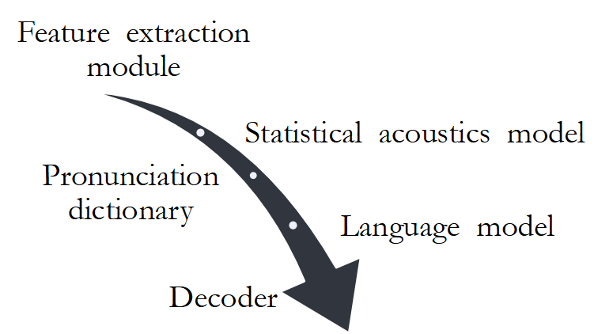
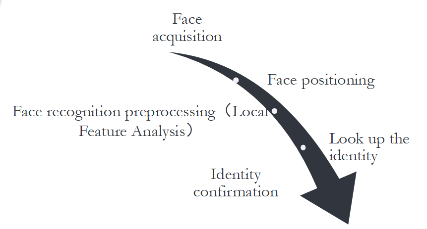
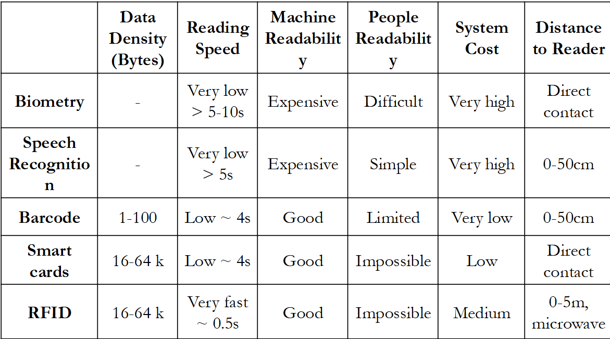
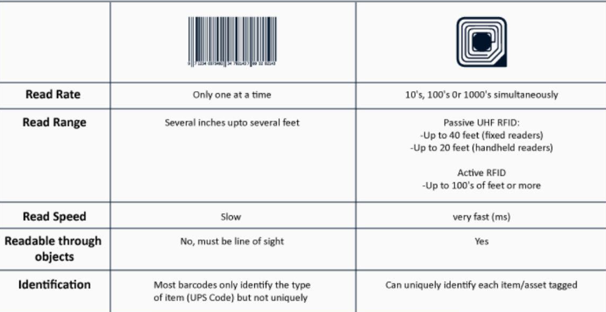
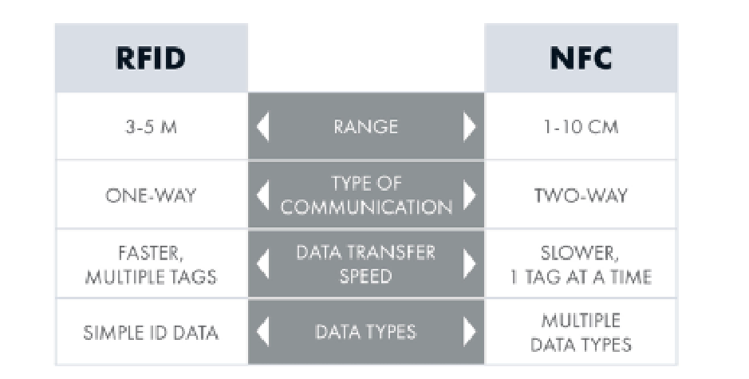
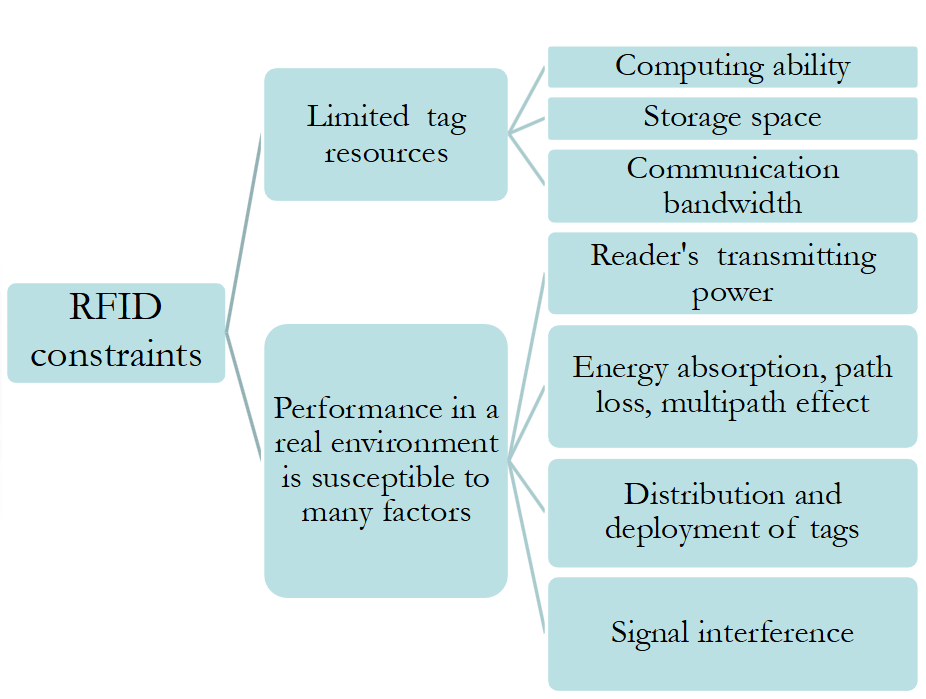
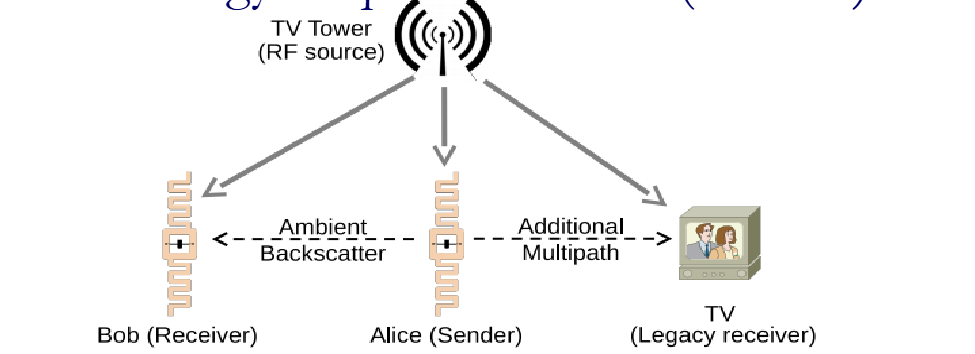
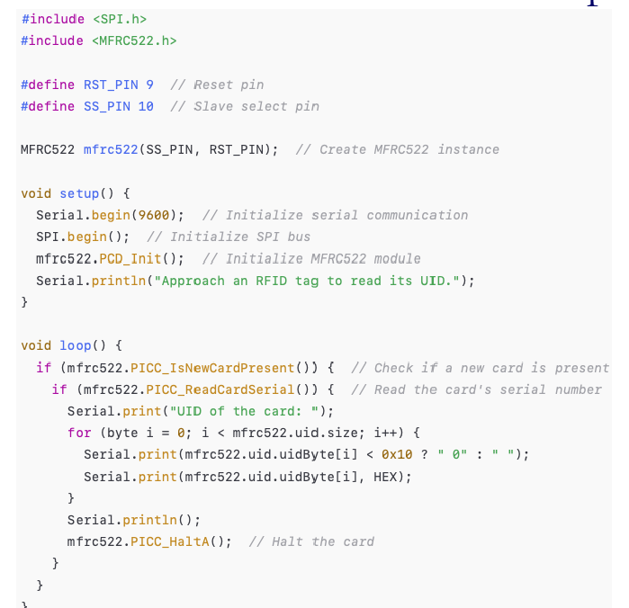

# WEEK1：

## Lecture 1

## 一.What is RFID?

#### **Definition**: 

- RFID (Radio Frequency Identification) is a technology that uses radio waves to  transfer energy and data between a **reader** and a **movable item** to identify,  categorize, track, …

- The item can be an object, a person, an animal, etc. 

- RFID is fast, reliable, and does not require physical sight or contact between  reader/scanner and the tag.

- RFID, dates back to the invention of RADAR, where, during the Second  World War, fighter pilots cleverly maneuvered their planes to be remotely  identified by friendly radar operators, who distinguished them from their foes (Identify Friend or Foe).

  

  

## 二.What Makes an RFID System?

#### **1.RFID Tag**:

- **Microchip**: Stores data (e.g., unique identifier).
- **Antenna**: Allows for communication with the reader.
- **Passive Tags: No battery, rely on energy from the reader. **
- **Active Tags: Contain a battery and can transmit signals over a longer range.**

#### **2.RFID Reader (Interrogator):**

- **Roles**: Transmit and receive signals between the reader and the tag. 
- **Reader Types:** **Fixed**, **handheld**, and **mobile readers**.

#### **3.Antenna:**

- **Role: **Allows the exchange of data between the tag and reader.
- **Types： **Directional, omni-directional, near-field, and far-field antennas.

#### **4.Software (Middleware)**

- **Role: **  Software used to process data between the RFID system and enterprise  applications.

## 三.How Does RFID Work?

#### **1.Basic Workflow:**

- **Reader:** The RFID reader sends a radio signal to the tag, which powers it and  causes the tag to respond with its stored data.
- **Tag: **The tag, powered by the reader's signal (for passive tags), emits a unique ID  or data when it comes into range.
- **Communication:** The data is sent back to the reader, which transmits it to the  system for processing.

#### **2.No Line of Sight Needed:**

- Unlike barcodes, RFID does not require a direct line of sight between the reader  and the tag.

#### **3.Multiple Tags:**

- Multiple RFID tags can be read simultaneously, making RFID more efficient for  tracking large quantities of items.

## 四.Automatic Identification Technology

#### **1.Automatic identification:**

- The essence of the recognition technique is to distinguish and identify the physical objects using their identifiable features.

#### **2.Biometric Procedures：**

- **Fingerprinting procedures**
- Voice identification
- Face recognition
- Retina identification
- Heartbeat recognition technology

#### **3.Fingerprint Identification**

- Fingerprint identification uses the uniqueness and stability of fingerprint to verify user identity by comparing the collected
  fingerprints with the pre-sampled fingerprints.
- **Stability：** High accuracy of identification，Low error rate，Each fingerprint has multiple feature points，Each feature point has 5 to 7 features，Ten fingers can produce at least 4900，independent features that can be measured
- **High speed：** Fingerprint match can be completed in 1 to 2 seconds
- **Security issues**： Fingerprints are easy to leave over，Fingerprint replication is getting easier

#### **4.Speech Recognition：**

- Speech recognition uses **the difference** between **each person's tone** and **timbre** to identify different people.
- 
- Technical Features： **Easy to use, and easily accepted by the user**；**Cheap sound equipment**, and **not involve user's privacy**；**Due to the lack of international standards, there are some difficulties in promoting**

#### **5.Face Recognition：**

- Face recognition is based on human face features. It performs identity authentication by analyzing the input face
  image.
- 
- Technical Features： **surroundings** , **hair ornaments**, **age can affect the recognition rate**，**Fast recognition speed**, **not easy to be aware of it**

#### **6.Other Biometric Procedures:**

- **Retina recognition technology:** distinguish each person by analyzing the vascular pattern on the retina.
- **Heartbeat recognition technology:** identify the user identity by collecting heartbeat signal pulse through a specific
  instrument and then identify the inherent characteristics of
  each person heartbeat.

## 五.Bar Codes

- The barcode is a **binary code** comprising a field of bars and gaps arranged in a **parallel configuration**

#### **1.1D Barcode Recognition:**

- 1D barcode is a **combination of lines and blanks** in accordance with certain coding rules to **represent certain information.**
- 1D barcode **only express information in the horizontal direction**, and **in the vertical direction does not express any information**. It usually **retains a certain height** to facilitate the alignment of the reader.
- **Limited storage capacity**, need to **combine with the database**. The barcode **size is relatively large, the space utilization is low.**
  **Fault tolerance** is **poor**, **cannot restore the information after the corruption**.

#### **2.2D Code Recognition：**

- 2D code uses **black and white graphics** on the **two-dimensional plane to record data**, these geometric patterns express specific information through a **certain regulation of distribution**
- **Positioning point technology:** 2D code usually has **three positioning points** for the reader to identify. Because of these positioning points, 2D code **can be identified no matter what direction to read.**
-  **Fault tolerance:** the information **can be correctly restored** when it **does not recognize all of the 2D code**, or if the 2D code **is defaced**.
- **Large storage capacity. Up to 32KB.**
- **High information density. Can store text, sound, pictures and other information.**
- **Powerful error correction capability**. 2D code can still be identified in the case of **50% defacement**.
- Support for **encryption**. **Multiple security features**.

## 六.Card Technologies

- **Magnetic cards:** containing either **a magnetic strip** or **a magnetic object** in the card, **encoded with digital data**
- **Smart cards:** credit card-sized pieces of plastic **containing a data storage system**. **Two type:** **memory cards** and **microprocessor cards**
- **Optical cards:** use a technology similar to the one used for music CDs or CD-ROMs

## 七.Summary of Automatic Identification Technologies

## 八.RFID vs Barcode 

**Three advantages of using RFID compared to bar code scanning are:**

- **More efficiency**: you can scan multiple items at once
- **More durability:** tags can handle exposure to weather conditions like sun and
  rain
- **More security:** you can encrypt RFID tags so only your reader can get the data

## 九.RFID vs NFC

- Near-field communication (NFC) is **a subset of the RFID technology family**. The **big difference** is that **NFC is used for two-way communication**. **Instead of the scanner receiving or sending data**, **both ends can receive and send information**.
- 

## 十.History of RFID

#### **1.Early Beginnings:**

- **1940s:** RFID technology has roots in radar systems developed during WWII.
- **1948:** The concept of passive radio-frequency identification is introduced by **Harry Stockman**, who wrote about the potential for using radio waves to transmit information for identification purposes.

#### **2.Development Milestones:**

- **1960s:** The first RFID tag was created for use in toll collection.
- **1970s:** Early commercial use of RFID tags for asset tracking and livestock
  identification.
- **1990s:** Introduction of EPC (Electronic Product Code) and the formalization of
  RFID standards.
- **2000s:** Widespread adoption of RFID in supply chain management, retail, and
  healthcare.

#### **3.Modern-Day RFID:**

- The rapid development of low-cost, efficient RFID tags.
- Growth of smart labels (integrated RFID chips with barcodes or sensors).
  37

## 十一.MAIN FEATURES OF RFID SYSTEMS

#### **1.RFID Systems:**

- Provide an effective solution for the core problem of **"realizing passive intelligence", "globally unique
  identification"** and **"low-cost interconnection"** in Internet of Things applications.
- Non-contact automatic fast identification
- **Accurate and efficient identification**
- **Low cost and low power consumption**
- **Certain computing and storage capabilities**

#### **2.Main Features of RFID **

##### ***Non-contact automatic and rapid identification:***

- The RFID tag returns data by backscattering the energy, with
  an effective communication range of 6-10 m.
- The RFID system uses an effective anti-collision mechanism
  to read tags, enabling rapid identification of a large number of
  tags.

##### ***Permanently store a certain amount of data:***

- RFID tag has a user storage area, which can store **1KB-10KB** of
  user data.

##### ***Simple logical processing:***

- RFID has a very limited number of internal logic gates, so only a simple logical processing can be made.
- But the RFID system can use the basic logic processing ability of tags to achieve some effective protocols and algorithms to improve the system operating efficiency and security performance.

##### ***Reflection signal strength is affected by the distance and other factors significantly***

- Since the RFID tag itself is a passive device, the feedback signal must be modulated by backscatter. Therefore, the strength of the RFID tag reflection signal is susceptible to the surrounding environment, including distance, reader power, signal interference,and tag deployment density

##### ***Low cost, can be deployed at a large scale:***

- RFID tags tend to **large-scale mass production using printed circuits**, so manufacturing costs can be significantly reduced.
  At present, the cost of an RFID tag can be controlled at **around 10 cents**.

#### **3.RFID Challenges**

##### ***Anti-collision mechanism：***

- Conflict between tags, between readers, between reader and tags
- Traditional wireless communication protocols (such as CSMA / CA) are not available
- **RFID environment:** tag identification protocols must be simple and efficient
- How to effectively avoid conflicts, improve transmission performance, and reduce the scan delay?

##### ***Efficient information storage, retrieval and mining：***

- How to **efficiently store, retrieve and mine ID, keyword information, and sensing data carried by RFID tags in a distributed environment**？

##### ***Make full use of the attenuation laws of backscatter signal to assist in positioning and mobile behavior sensing***

- **Accuracy Low precision:** within a few meters; **High precision:** within a few centimeters
- Real time
- Stable Mean error, stability (confidence interval of error）

##### ***Security certification and privacy protection：***

- Forged tags: how to validate?
- Malicious reader: how to prevent illegal access and protect user privacy effectively？
- Existing algorithms require more logical processing units, e.g., AES requires 20000-30000 logic gates
- RFID tags have only 5000-10000 logic gates
- How to implement authentication and privacy protection protocols in a resource-constrained RFID system in a lightweight way?

## 十二.DEVELOPMENT TRENDS IN RFID
#### **1.Energy Acquisition Mode**

- **Backscatter**: time of endurance is prolonged indefinitely, small node size
- **Disadvantages**: rely on the reader, one to many centralized communication

#### **2.Energy Acquisition Mode **

- Design and implement innovative energy harvesting ways to support communication between systems, **in order to fully expand the scope and deployment scale of RFID applications**
- **Ambient backscatter:**Create new types of network communication **by leveraging radio signals** (such as television and cellular network base station signals) that are prevalent in the environment.

#### **3.Support Point-to-Point Communications**

- Design and implement innovative channel awareness technologies that **enable RFID devices to establish networks
  and implement point-to-point communications in a passive way to support multiple distributed applications**

#### **4.Combine with Sensors**

-  Integrating existing micro-sensor devices, combined with multimode sensors, provides a **richer application model based on backscatter technology.**

## 十三.RFID WITH ARDUINO

#### **1.What is Arduino?:**

- Arduino is an open-source electronics platform based on easy-to-use hardware and software.

#### **2.RFID and Arduino: **

- Arduino can be used to interface with RFID tags and readers, enabling practical applications such as access control, asset tracking, and inventory management.

#### **3.Basic Components:**

- **Arduino Board:** For processing and controlling the project.
- **RFID Reader:** Such as the MFRC522 module, commonly used in Arduino projects.
- **RFID Tags:** Passive or active RFID tags.
- **Jumper Wires:** To connect the RFID reader to the Arduino board.

#### **4.Required Components:**

- Arduino Uno or similar board.
- RFID Module (e.g., MFRC522).
- RFID tags/cards.
- Jumper wires and breadboard **(optional)**.
- LED for visual feedback **(optional)**.

#### **5.Connections:**

- Connect the RFID module to the Arduino using specific pins for SPI communication (SDA, SCK, MOSI, MISO, IRQ, and RST).

#### **6.Code Example:**

#### **7.Challenges and Considerations:**

- **Distance Limitations:** RFID tag reading distance can be limited, especially with passive tags.
- **Interference:** Materials like metal and liquids can interfere with the RFID signal.
- **Power Consumption:** Active RFID tags need a power source, whereas passive tags do not.
- **Data Security:** Proper security measures must be considered when dealing
  with sensitive data.

#### **8.Enhancing RFID Projects with Sensors and Arduino:**

- **Integrating Sensors:** Adding environmental sensors (e.g., temperature, humidity) to RFID projects for more intelligent data collection.